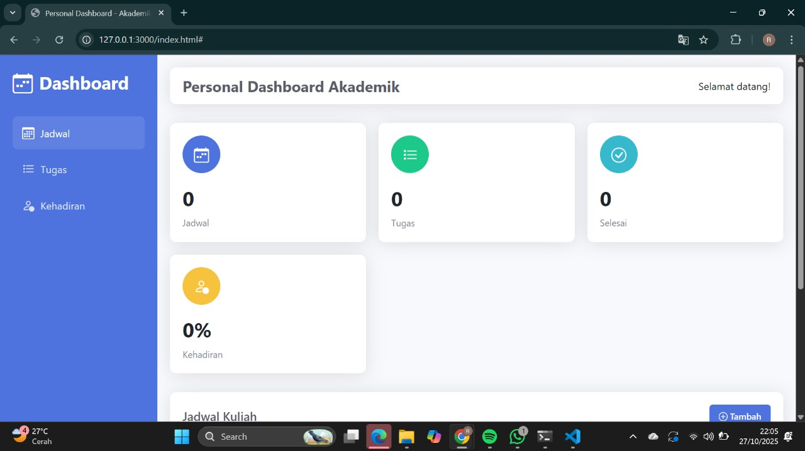

📊 Personal Dashboard Akademik

Personal Dashboard Akademik adalah aplikasi berbasis web yang berfungsi sebagai pusat informasi akademik pribadi. Aplikasi ini membantu pengguna untuk memantau jadwal kuliah, daftar tugas, serta persentase kehadiran secara interaktif dan efisien.

🚀 Fitur Utama

Manajemen Jadwal
Menampilkan daftar jadwal kuliah dengan tampilan yang rapi dan mudah dibaca.

Manajemen Tugas
Pengguna dapat melihat daftar tugas yang harus dikerjakan dan status penyelesaiannya.

Rekap Kehadiran
Menampilkan persentase kehadiran pengguna dalam bentuk visual yang jelas.

Navigasi Sidebar Dinamis
Sidebar interaktif dengan ikon yang memudahkan perpindahan antar halaman (Jadwal, Tugas, Kehadiran).

💡 Fitur ES6+ yang Diimplementasikan

Beberapa fitur JavaScript modern (ES6+) yang digunakan dalam pengembangan aplikasi ini antara lain:

Arrow Function (=>) untuk fungsi yang lebih ringkas dan mudah dibaca.

Template Literals untuk manipulasi string dengan ekspresi dinamis.

Destructuring Assignment untuk ekstraksi nilai dari array/objek secara efisien.

Modules (import/export) untuk memisahkan dan mengatur kode ke dalam file modular.

Promises & Async/Await untuk menangani proses asynchronous seperti pengambilan data.

Local Storage API untuk menyimpan data pengguna secara lokal di browser.

🖼️ Screenshot Aplikasi

Tampilan utama dashboard aplikasi:

